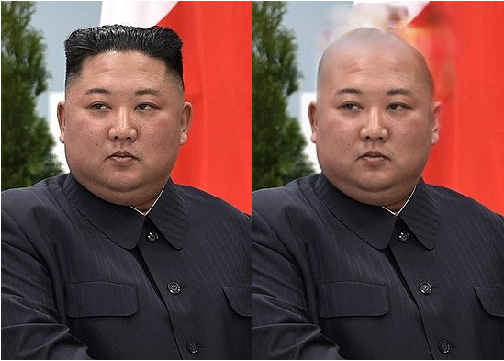
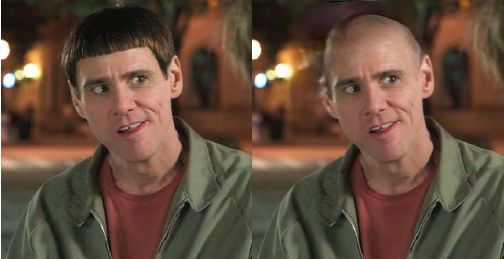
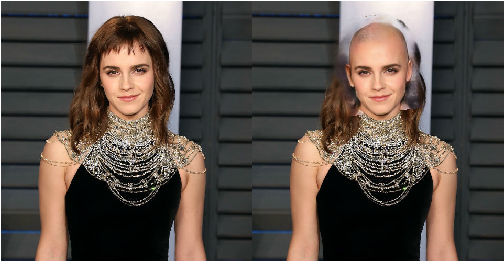

# BaldGAN





This repository contains:
  - The source code for training the GAN model making people bald
  - Data with bald people for training a neural network
  - Pretrained neural network weights

## Training data


Data consists of two parts:
  - Bald people
  - Wigs

| Dataset | Image count |
| ------ | ------ |
| Bald people | 3 698 |
| Wigs | 48 |

Bald people: [google disk](https://drive.google.com/file/d/1cPddWYSRMR0rxIzYc73tkbc73typTchJ/view?usp=sharing)
Bald people preprocessed for GAN:  [google disk](https://drive.google.com/file/d/1O_hP_-ZoVFmVi7D7dy1uyP1p4s_gNwQm/view?usp=sharing)
Wigs: [google disk](https://drive.google.com/file/d/1tCXb37m4rMnFl2HRAbi1aFQ85FOqpsZS/view?usp=sharing)

Bald people were obtained from: 
  - CelebA with manual filtration
  - Collected manually from pinterest.com

## Training

Pretrained model: [google disk]( https://drive.google.com/file/d/1Fh_H2CayIGhPmq0Q7SH4v03smKrnOrgY/view?usp=sharing)

The project is based on code from the [keras-gan repository](https://github.com/eriklindernoren/Keras-GAN).
As a face detector, [RetinaFace](https://github.com/deepinsight/insightface/tree/master/RetinaFace) is used.

Project structure:
  - pix2pix_InsNorm.py - network training script
  - data_loader_alpha_sintes.py - data generator
  - dataset_prepare.ipynb - notebook for data preparation (or just download the prepared)
  - check_results_v2_InsNorm_4x4.ipynb - notebook for testing in images

To start training:
```sh
$ CUDA_VISIBLE_DEVICES=1 python3 pix2pix_InsNorm.py
```

To achieve the best result, it is better to pretrain the generator without a discriminator.

Features of the used model:
  - Two discriminators: for the whole face and the area under the hair
  - Using perceptual loss
  - InstanceNormalization
